This project was bootstrapped with [Create React App](https://github.com/facebook/create-react-app).
Node.js is required to utilize its node package manager (npm)

## Installation

This project uses the following dependencies:


``` 
    "axios": "^0.18.0",
    "moment": "^2.22.2",
    "react": "^16.6.0",
    "react-bootstrap": "^0.32.4",
    "react-datepicker": "^1.7.0",
    "react-dom": "^16.6.0",
    "react-phone-input-2": "^2.6.1",
    "react-redux": "^5.1.0",
    "react-router-dom": "^4.3.1",
    "react-scripts": "2.0.5",
    "redux": "^4.0.1",
    "redux-thunk": "^2.3.0" 
```

These dependancies are already listed in the package.json file.
To install, simply run :
### `npm install`
    

## Available Scripts

In the project directory run:

### `npm start`

Open [http://localhost:3000](http://localhost:3000) to view it in the browser.

The page will reload if you make edits.<br>

### `npm test`

Launches the test runner in the interactive watch mode.<br>

### `npm run build`

Builds the app for production to the `build` folder.<br>
It correctly bundles React in production mode and optimizes the build for the best performance.

The build is minified and the filenames include the hashes.<br>

In the api directory `/companymanager/managerapi` you can run :

### `node .`

This will run the api server locally on [http://localhost:1994](http://localhost:1994)

## Supported Browsers

By default, the generated project supports all modern browsers.<br>
Support for Internet Explorer 9, 10, and 11 requires [polyfills](https://github.com/facebook/create-react-app/blob/master/packages/react-app-polyfill/README.md).

## Features

### 1.) Create Company:
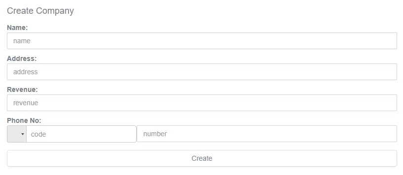


Fields that haven't been filled will display an error label upon pressing create

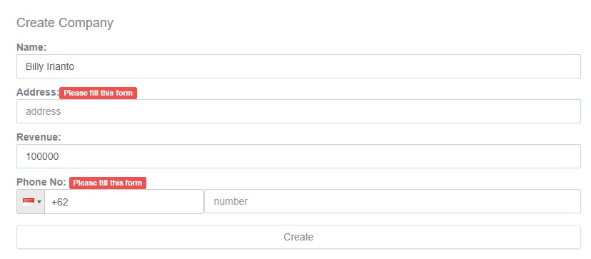

Phone code can be selected via dropdown. Revenue and phone number fields can only be inputted with positive floor numbers

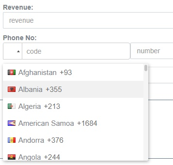

An alert will be shown upon succesful creation

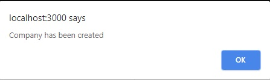

All created Companies will display as cards under the Company section on the main page

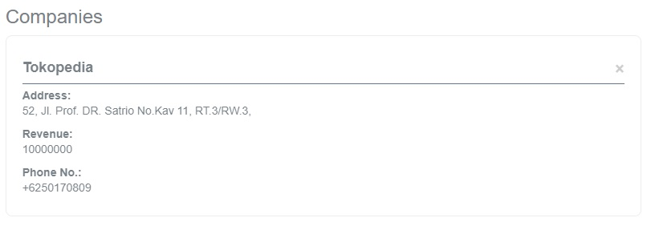

### 2.) Create Office:

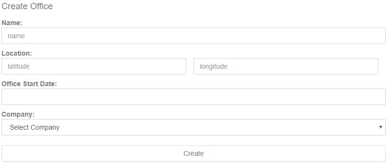

Fields that haven't been filled will display an error label upon pressing create

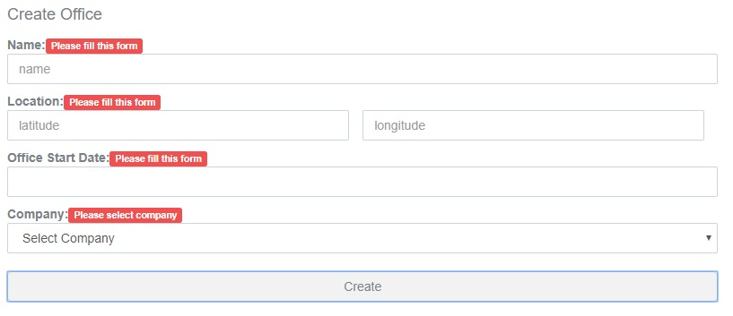

Date selection uses a datepicker widget

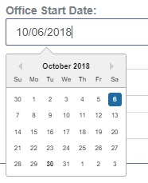

Any created companies will appear in the Company dropdown

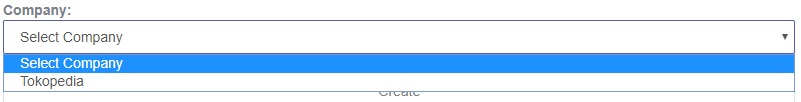

An alert will be shown upon succesful creation

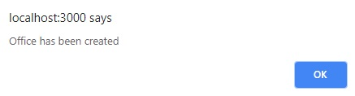

### 3.) Information Display:

All created Companies will display as cards under the `Companies` section on the main page


Clicking on the X on the upper right will prompt the deletion of the company card (along with all associated offices) from the database

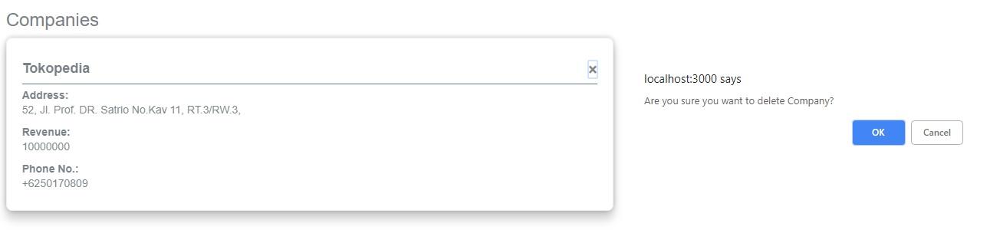

Clicking on a company card will redirect you to it's respective page, detailing it's offices

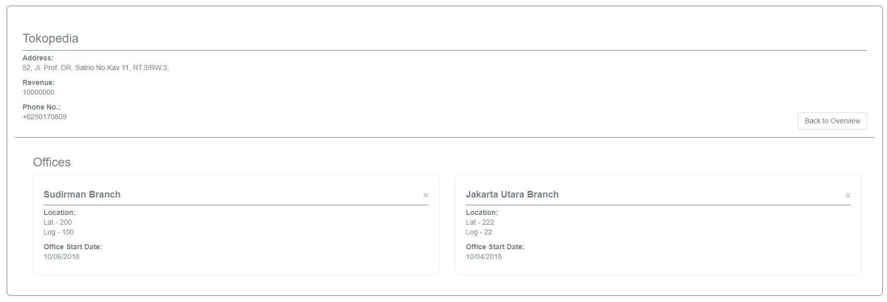

Clicking on the X on the upper right of the office card will also prompt its deletion

Clicking on `Back to Overview` will return you to the main page

## System Design

Data handling is mostly done through the global state

The system uses two reducers, one for all company data and the other for all office data

```
export default combineReducers({
    companies: CompanyReducer,
    offices: OfficeReducer
})
```

The component `OverviewPage` recieves the companies reducer

```
const mapStateToProps = (state) =>{
    const { companies }= state
    return { companies }
}

export default connect(mapStateToProps, {getCompanies})(OverviewPage)
```

Then the company data will be displayed with `CompanyCard` component via mapping

```
if(this.props.companies.length === 0){
            return(
                <div>There are no companies created yet</div>
            )
        }
        else{
            var arrJSX = this.props.companies.map((company) => {
                return(<CompanyCard key={company.id} id={company.id} name={company.name} address={company.address} revenue={company.revenue} phoneCode={company.phoneCode} phoneNumber={company.phoneNumber} history={this.props.history}/>)
            })
            return arrJSX
        }
```

The component `OfficesPage` recieves the companies and offices reducer.
Upon selection of a `CompanyCard` the page will be redirected to `/companies/:companyId` , in which companyId will be passed from the id of the selcted company

Since the companies reducer contains data for all companies, it is first filtered via looping to acquire the data of the selected company

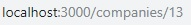   `props.match.params.companyId = 13`

```
const mapStateToProps = (state, props) => {
    const { companies, offices } = state
    var selectedCompany = {}
    for(var index in companies){
        if(parseInt(props.match.params.companyId) === parseInt(companies[index].id)){
            selectedCompany = companies[index]
        }
    }

    return { selectedCompany, offices }
}
```

The offices reducer is also filtered to only obtain data for the offices of the selected company. Filtering is done during mapping of the `RenderOffices()` function of the `OfficesPage` component.

```
    renderOffices(){
        var arrJSX = this.props.offices.map((office) => {
            if(parseInt(office.companyId) === parseInt(this.props.match.params.companyId))
                return(
                <Officecard key={office.id} id={office.id} name={office.name} longitude={office.longitude} latitude={office.latitude} startDate={office.startDate}/>
            )
        })
        console.log(arrJSX)
        if(arrJSX.length === 0){
            return(
                <div>There are no offices created yet</div>
            )
        }
        else{
            return arrJSX
        }
    }
```


